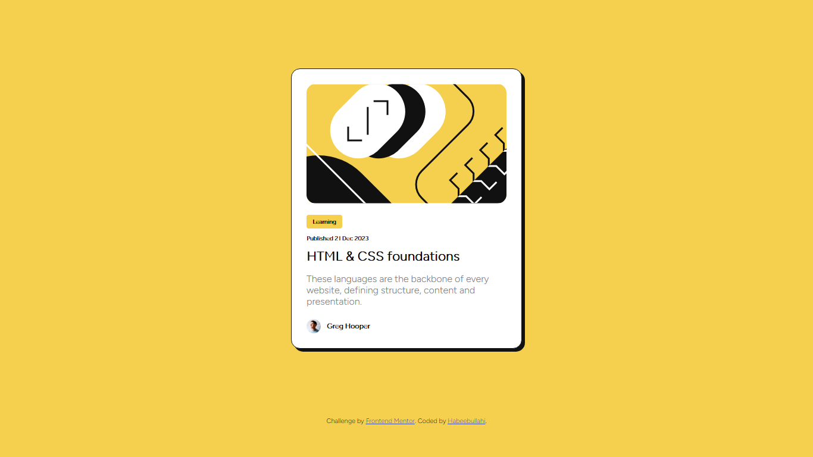
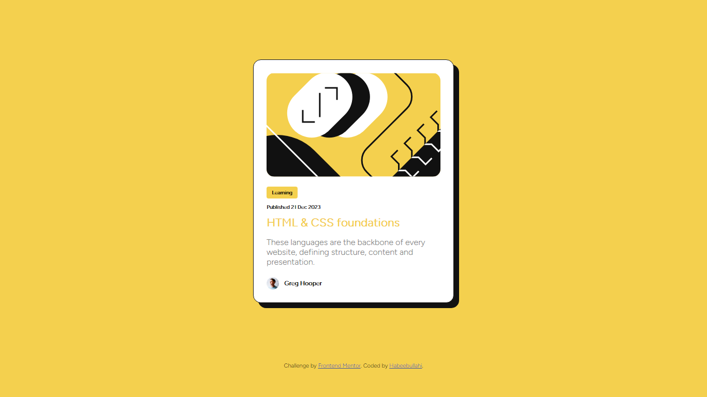

# Frontend Mentor - Blog preview card solution

This is a solution to the [Blog preview card challenge on Frontend Mentor](https://www.frontendmentor.io/challenges/blog-preview-card-ckPaj01IcS). Frontend Mentor challenges help you improve your coding skills by building realistic projects.

## Table of contents

- [Overview](#overview)
  - [The challenge](#the-challenge)
  - [Screenshot](#screenshot)
  - [Links](#links)
- [My process](#my-process)
  - [Built with](#built-with)
  - [What I learned](#what-i-learned)
  - [Continued development](#continued-development)
  - [Useful resources](#useful-resources)
- [Author](#author)
- [Acknowledgments](#acknowledgments)

**Note: Delete this note and update the table of contents based on what sections you keep.**

## Overview

### The challenge

Users should be able to:

- See hover and focus states for all interactive elements on the page

### Screenshot

Normal State

Hovered State


### Links

- Solution URL: [github.com](https://github.com/Bn-Bushra/Coding-with-Frontend-Mentor/tree/main/blog-preview-card-main)
- Live Site URL: [byteburaq-blogcard.netlify.app](https://byteburaq-blogcard.netlify.app)

## My process

### Built with

- Semantic HTML5 markup
- CSS custom properties
- Flexbox
- Desktop-first workflow
- For styles

### What I learned

Box shadow
Semantics
More Flexbox
Img proportioning
Dynamic units

To see how you can add code snippets, see below:

```html
<!-- Some HTML code I'm proud of -->
<div class="card">Learning</div>
```

```css
/*.proud-of-this-css */
.container {
  display: flex;
  flex-direction: column;
  justify-content: center;
  width: fit-content;
  margin: 15vh auto;
  padding: 25px;
  border-radius: 15px;
  background-color: var(--white);
  border: 1px solid var(--black);
  box-shadow: 5px 5px 0px var(--black);
  animation: all 1s cubic-bezier(0.075, 0.82, 0.165, 1);
}
```

### Continued development

Form Validition
Structuring
Design Conversion

### Useful resources

## Author

- Website - [My Website](https://byteburaq-blogcard.netlify.app)
- Frontend Mentor - [@Bn-Bushra](https://www.frontendmentor.io/profile/Bn-Bushra)
- Twitter - [@byteburaq](https://www.twitter.com/byteburaq)

## Acknowledgments

Alhamdulillah. Wa jakazumullahu khayran jazah.
