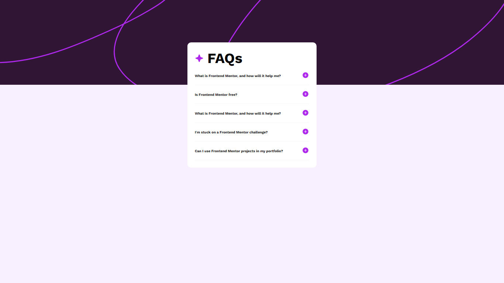
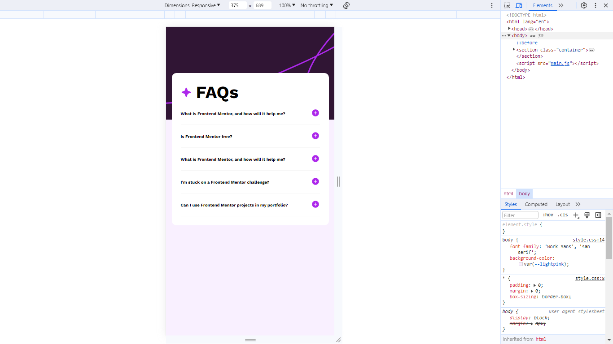

# Frontend Mentor - FAQ accordion solution

This is a solution to the [FAQ accordion challenge on Frontend Mentor](https://www.frontendmentor.io/challenges/faq-accordion-wyfFdeBwBz). Frontend Mentor challenges help you improve your coding skills by building realistic projects.

## Table of contents

- [Overview](#overview)
  - [The challenge](#the-challenge)
  - [Screenshot](#screenshot)
  - [Links](#links)
- [My process](#my-process)
  - [Built with](#built-with)
  - [What I learned](#what-i-learned)
  - [Continued development](#continued-development)
  - [Useful resources](#useful-resources)
- [Author](#author)
- [Acknowledgments](#acknowledgments)

## Overview

### The challenge

Users should be able to:

- Hide/Show the answer to a question when the question is clicked
- Navigate the questions and hide/show answers using keyboard navigation alone
- View the optimal layout for the interface depending on their device's screen size
- See hover and focus states for all interactive elements on the page

### Screenshot




### Links

- Solution URL: [Github Directory](https://github.com/Bn-Bushra/Coding-with-Frontend-Mentor/tree/8e2ff84be4eee7160cc74f6951e1aac7238eba10/faq-accordion-main)
- Live Site URL: [FAQ Accordion](https://byteburaq-faqaccordion.netlify.app)

## My process

### Built with

- Semantic HTML5 markup
- CSS custom properties
- Flexbox
- CSS Grid
- Mobile-first workflow
- Javascript Toggling

### What I learned

Javascript toggling and dynamic changing of collapsing icon and expanding icon.

````html
<div class="qabox">
  <div class="question">
    <h3>Lorem ipsum dolor sit amet.?</h3>
    <span
      >
      </span>
  </div>
  <div class="answer">
    <p>lorem ipsum</p>
  </div>
</div>
````
````css
.qabox.active .answer {
   max-height: fit-content;
}
.minus-icon {
  display: none;
}
.qabox.active .question .plus-icon {
  display: none;
}
.qabox.active .question .minus-icon {
  display: block;
}
.qabox img {
  transition: all 0.6s ease;
}
````

````js
const qaboxes = document.querySelectorAll('.qabox');
qaboxes.forEach((qabox) => {
  qabox.addEventListener('click', () => {
    qabox.classList.toggle('active');
  });
});
````

### Continued development

I was not able to place the background image successfully. I would like to know more about it.

### Useful resources

## Author

- Website - [My website](https://www.twitter.com/byteburaq)
- Frontend Mentor - [@bn-bushra](https://www.frontendmentor.io/profile/bn-bushra)
- Twitter - [@byteburaq](https://www.twitter.com/byteburaq)


## Acknowledgments

Alhamdulilah. Wa jazakumullahu khayran jazah.
