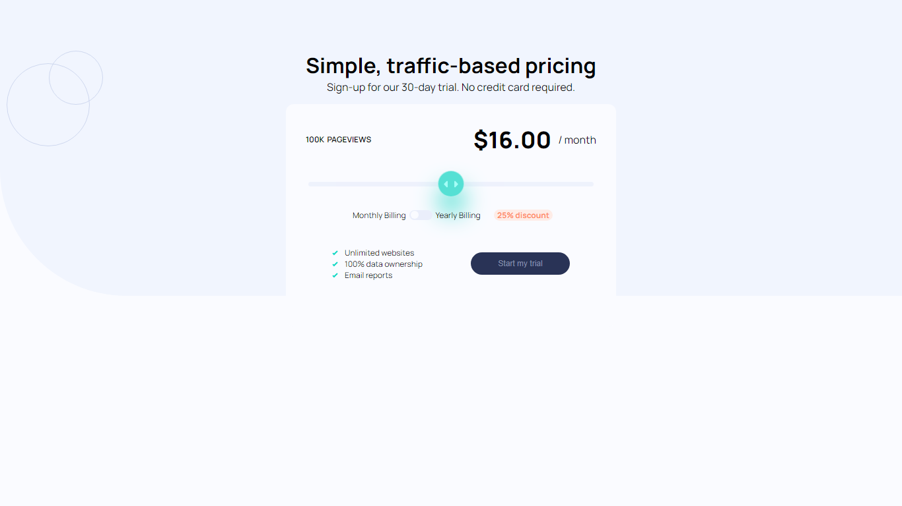

# Frontend Mentor - Interactive pricing component solution

This is a solution to the [Interactive pricing component challenge on Frontend Mentor](https://www.frontendmentor.io/challenges/interactive-pricing-component-t0m8PIyY8). Frontend Mentor challenges help you improve your coding skills by building realistic projects.

## Table of contents

- [Overview](#overview)
  - [The challenge](#the-challenge)
  - [Screenshot](#screenshot)
  - [Links](#links)
- [My process](#my-process)
  - [Built with](#built-with)
  - [What I learned](#what-i-learned)
  - [Continued development](#continued-development)
  - [Useful resources](#useful-resources)
- [Author](#author)
- [Acknowledgments](#acknowledgments)

## Overview

### The challenge

Users should be able to:

- View the optimal layout for the app depending on their device's screen size
- See hover states for all interactive elements on the page
- Use the slider and toggle to see prices for different page view numbers

### Screenshot



### Links

- Solution URL: [Github Directory](https://github.com/Bn-Bushra/Coding-with-Frontend-Mentor/tree/fd3ecd4104f157fbece9c6b9820b1abe0546e6ce/interactive-pricing-component-main)
- Live Site URL: [Interactive Pricing Component](https://byteburaq-pricingcomponent.netlify.app)

## My process

### Built with

- Semantic HTML5 markup
- CSS custom properties
- Flexbox
- Relative Position and Absolute
- Desktop-first workflow

### What I learned

- Making of toggle button using javaScript
- making of custom slider with html,css and js
- More use cases of Flex box.
- Adding few touches of CSS brings buttons and click to life.

```html
<--! The bone of the the billing section -->
<section class="billing">
  <div class="discount-billing">
    <p>Monthly Billing</p>
    <span class="toggle-discount" onclick="toggleDiscount()">
      <span class="toggle" id="discountToggle"></span>
    </span>
    <p>Yearly Billing</p>
  </div>
  <p class="discount-text" id="discountText">25% discount</p>
</section>
```

```css
/*used this to change the colour of the toggle button on click*/
.toggle-discount.active {
  background-color: var(--STRONGCYAN);
}
```

```js
//used this to display discount and change price
var isDiscountActive = false;
function toggleDiscount() {
  isDiscountActive = !isDiscountActive;
  updateToggleState();
  updatePrice();
}
```

### Continued development

- Even though I was able to figure how to customise the slider, I couldn't make the background color change upon scrolling.
- I got stucked in making it responsive.
- I couldn't make the slider go in between the pageviews and price in the mobile version.
- I am getting to know some basic component of a website like faq accordion, blog card, pricing card etc. and will like to explore more by doing.

### Useful resources
I saw many videos on for these, I might link some of them in the future.

## Author

- Website - [Website](https://www.twitter.com/byteburaq)
- Frontend Mentor - [@bn-bushra](https://www.frontendmentor.io/profile/bn-bushra)
- Twitter - [@byteburaq](https://www.twitter.com/byteburaq)

## Acknowledgments

Alhamdulillah. Wa jazakumullahu Khayran jazah.
