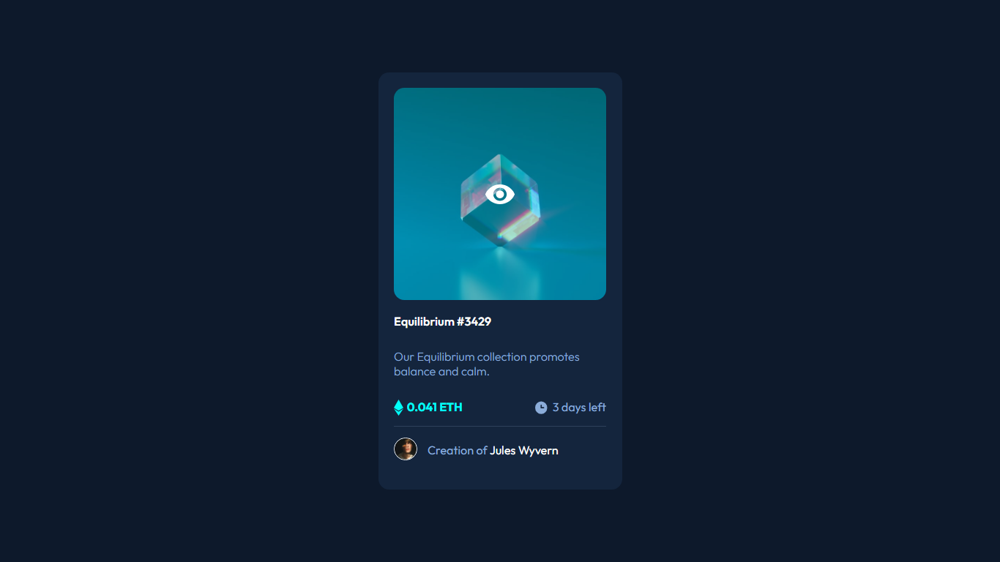
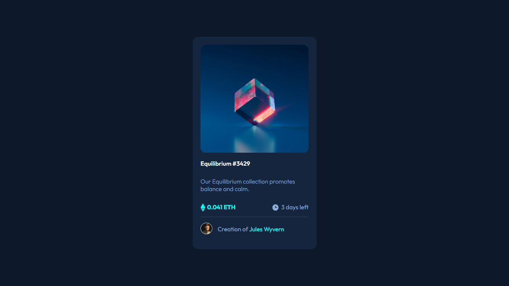
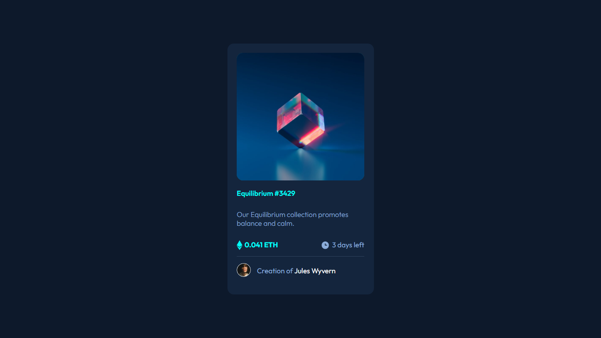

# Frontend Mentor - NFT preview card component solution

This is a solution to the [NFT preview card component challenge on Frontend Mentor](https://www.frontendmentor.io/challenges/nft-preview-card-component-SbdUL_w0U). Frontend Mentor challenges help you improve your coding skills by building realistic projects. 

## Table of contents

- [Overview](#overview)
  - [The challenge](#the-challenge)
  - [Screenshot](#screenshot)
  - [Links](#links)
- [My process](#my-process)
  - [Built with](#built-with)
  - [What I learned](#what-i-learned)
  - [Continued development](#continued-development)
  - [Useful resources](#useful-resources)
- [Author](#author)
- [Acknowledgments](#acknowledgments)

## Overview

### The challenge

Users should be able to:

- View the optimal layout depending on their device's screen size
- See hover states for interactive elements

### Screenshot
Screenshot of my solution.

### Links

- Solution URL: [Github](https://your-solution-url.com)
- Live Site URL: [Live Site](https://your-live-site-url.com)

## My process

### Built with

- Semantic HTML5 markup
- CSS custom properties
- Flexbox
- CSS Grid
- Mobile-first workflow
- CSS positioning

### What I learned

- I utilised self explanatory class names.
- CSS positioning : Relative, Absolute, Sticky, Fixed ...

### Continued development

I'm looking forward to mastering DOM Manipulation and using it in my subsequent projects.

### Useful resources

## Author

- Website - [Byteburaq](https://www.your-site.com)
- Frontend Mentor - [@bn-bushra](https://www.frontendmentor.io/profile/bn-bushra )
- Twitter - [@byteburaq](https://www.twitter.com/byteburaq)

## Acknowledgments

Alhamdulillah. Wa jazakumullahu Khayran jazzah.