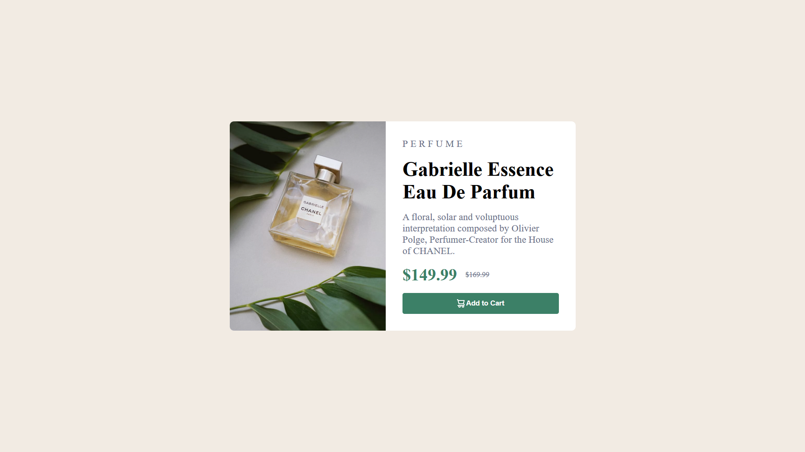

# Frontend Mentor - Product preview card component solution

This is a solution to the [Product preview card component challenge on Frontend Mentor](https://www.frontendmentor.io/challenges/product-preview-card-component-GO7UmttRfa). Frontend Mentor challenges help you improve your coding skills by building realistic projects.

## Table of Contents

- [Overview](#overview)
  - [Challenge](#challenge)
  - [Screenshots](#screenshots)
  - [Links](#links)
- [My Process](#my-process)
  - [Built With](#built-with)
  - [Learnings](#learnings)
  - [Future Development](#future-development)
  - [Resources](#resources)
- [Author](#author)
- [Acknowledgments](#acknowledgments)

## Overview

### Challenge

The goal is to create a results summary component that allows users to view the layout optimally based on their device's screen size. Additionally, users should experience hover and focus states for interactive elements like the "Add to Cart" button.

### Screenshots

My solution

### Links

- Solution URL: [GitHub](https://github.com/Bn-Bushra/Coding-with-Frontend-Mentor/tree/8b5a2257c03ee29578f3e9f2e47f60f59e1bf58f/product-preview-card-component-main)
- Live Site URL: [Live Site](https://byteburaq-productpreview.netlify.app)

## My Process

### Built With

- Semantic HTML5 markup
- SCSS
- CSS custom properties
- Flexbox
  
### Learnings

While working on this project, I learned how to create a product preview page in HTML and CSS (SCSS). Understanding how to insert background image accordingly was a key takeaway.

### Future Development

Areas for future improvement include refining styles, enhancing accessibility, learning a CSS preprocessor language.

### Resources

## Author

- Frontend Mentor - [@bn-bushra](https://www.frontendmentor.io/profile/bn-bushra)
- Twitter - [@byteburaq](https://www.twitter.com/byteburaq)

## Acknowledgments

A shoutout to the Frontend Mentor community for their support and feedback during this challenge. Alhamdullilah. Wa jazakumullahu Khayran.

**Have fun building!** 🚀
