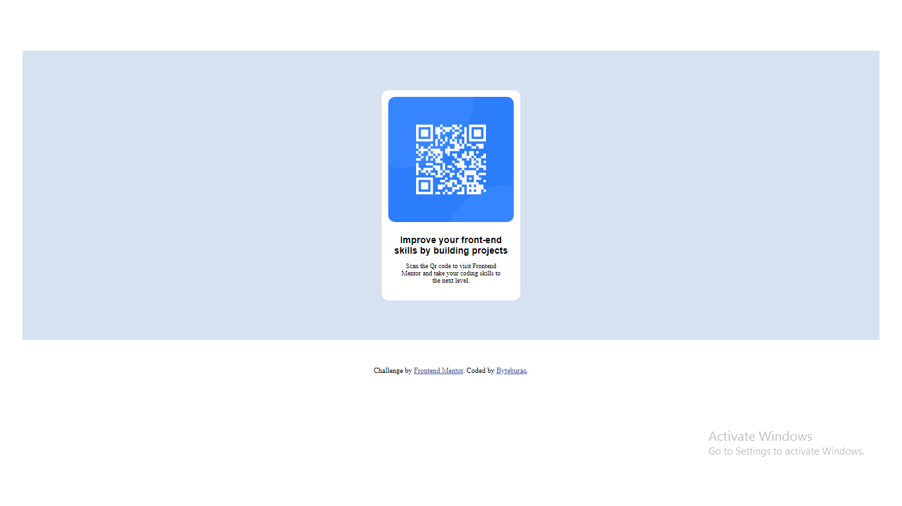

# Frontend Mentor - QR code component solution

This is a solution to the [QR code component challenge on Frontend Mentor](https://www.frontendmentor.io/challenges/qr-code-component-iux_sIO_H). Frontend Mentor challenges help you improve your coding skills by building realistic projects.

## Table of contents

- [Overview](#overview)
  - [Screenshot](#screenshot)
  - [Links](#links)
- [My process](#my-process)
  - [Built with](#built-with)
  - [What I learned](#what-i-learned)
  - [Continued development](#continued-development)
  - [Useful resources](#useful-resources)
- [Author](#author)
- [Acknowledgments](#acknowledgments)

## Overview

### Screenshot



### Links

- Solution URL: [github.com/Bn-Bushra/Coding-with-Frontend-Mentor](https://github.com/Bn-Bushra/Coding-with-Frontend-Mentor)
- Live Site URL: [lucent-praline-4eaebd.netlify.app](https//:lucent-praline-4eaebd.netlify.app)

## My process

### Built with

- Semantic HTML5 markup.
- CSS custom properties
- Flexbox
- Desktop-first workflow

### What I learned

I learnt the importance of design for a web developer. Design serve as a visual aid and makes the destination achievable.

I also learnt that structuring with HTML is key. See how I utilised semantism here.

```html
<div class="background">
  <div class="container">
    <div class="image">
      
    </div>
    <div class="image-text">
      <div class="heading"></div>
      <div class="paragraph"></div>
    </div>
  </div>
</div>
```

I used css flexbox to center the qr code container.

```css
.container {
  display: flex;
  flex-direction: column;
  justify-content: center;
  align-items: center;
}
```

### Continued development

I'll like to master CSS flex box and grid very well to be able to use efficiently and understand the working priciples of CSS.

### Useful resources

## Author

- Website - [My website](https://lucent-praline-4eaebd.netlify.app)
- Frontend Mentor - [@Bn-Bushra](https://www.frontendmentor.io/profile/Bn-Bushra)
- Twitter - [@byteburaq](https://www.twitter.com/byteburaq)

## Acknowledgments
Alhamdulillah. Wa jazakumullahu khayran Jazah.
