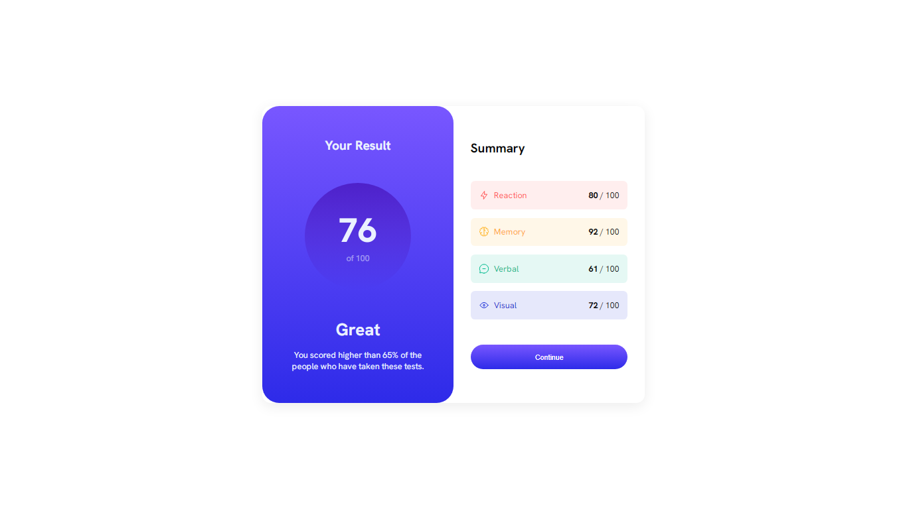

# Frontend Mentor - Results Summary Component Solution

This is a solution to the [Results summary component challenge on Frontend Mentor](https://www.frontendmentor.io/challenges/results-summary-component-CE_K6s0maV). Frontend Mentor challenges help you enhance your coding skills by building realistic projects.

## Table of Contents

- [Overview](#overview)
  - [Challenge](#challenge)
  - [Screenshots](#screenshots)
  - [Links](#links)
- [My Process](#my-process)
  - [Built With](#built-with)
  - [Learnings](#learnings)
  - [Future Development](#future-development)
  - [Resources](#resources)
- [Author](#author)
- [Acknowledgments](#acknowledgments)

## Overview

### Challenge

The goal is to create a results summary component that allows users to view the layout optimally based on their device's screen size. Additionally, users should experience hover and focus states for interactive elements.

### Screenshots
My solution

### Links

- Solution URL: [GitHub](https://github.com/Bn-Bushra/Coding-with-Frontend-Mentor/tree/861af43cbc690d92aa8d08ba24311d47015b2ffd/results-summary-component-main)
- Live Site URL: [Live Site](https://byteburaq-resultsummary.netlify.app)

## My Process

### Built With

- Semantic HTML5 markup
- CSS custom properties
- Flexbox
- JavaScript (Fetch API)
  
### Learnings

While working on this project, I learned how to dynamically update HTML content using data fetched from a local JSON file. Understanding the structure of the data and manipulating the DOM elements accordingly was a key takeaway.

### Future Development

Areas for future improvement include refining styles, enhancing accessibility, learning a CSS preprocessor language, APIs and exploring additional interactivity.

### Resources

## Author

- Frontend Mentor - [@bn-bushra](https://www.frontendmentor.io/profile/bn-bushra)
- Twitter - [@byteburaq](https://www.twitter.com/byteburaq)

## Acknowledgments

A shoutout to the Frontend Mentor community for their support and feedback during this challenge.

**Have fun building!** 🚀
