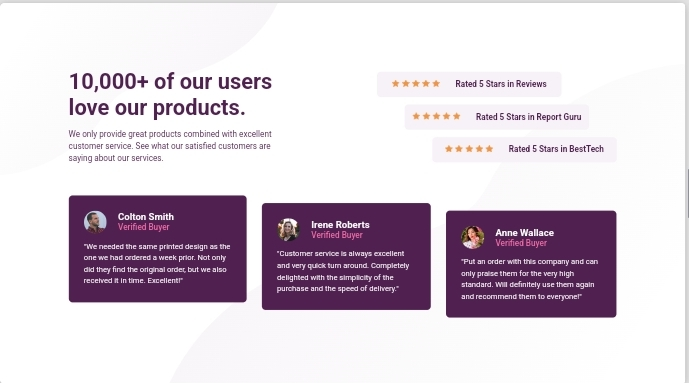

# Frontend Mentor - Social proof section solution

This is a solution to the [Social proof section challenge on Frontend Mentor](https://www.frontendmentor.io/challenges/social-proof-section-6e0qTv_bA). Frontend Mentor challenges help you improve your coding skills by building realistic projects. 

## Table of contents

- [Overview](#overview)
  - [The challenge](#the-challenge)
  - [Screenshot](#screenshot)
  - [Links](#links)
- [My process](#my-process)
  - [Built with](#built-with)
  - [What I learned](#what-i-learned)
  - [Continued development](#continued-development)
- [Author](#author)
- [Acknowledgments](#acknowledgments)

**Note: Delete this note and update the table of contents based on what sections you keep.**

## Overview

### The challenge

Users should be able to:

- View the optimal layout for the section depending on their device's screen size

### Screenshot

### Links

- Solution URL: [Add solution URL here](https://your-solution-url.com)
- Live Site URL: [Add live site URL here](https://your-live-site-url.com)

## My process

### Built with

- Semantic HTML5 markup
- CSS custom properties
- Flexbox
- Mobile-first workflow (it was pretty efficient but desktop first allows to build down instead of up.)

### What I learned
- I learned to structure almost anything woth flexbox. (Hope it's not too much).
- Background image positioning.
- I learned about sass as recommended by Frontend Mentor.
- By watching a 5 hours video of coder coder on freecodecamp channel where she worked on a frontend mentor project using `scss`.
- And another 2 hours video by codestackr on Yt.

### Continued development

I'll be using desktop-first interchangeably for now and probably start using `Sass` in my subsequent projects. 

## Author

- Frontend Mentor - [@bn-bushra](https://www.frontendmentor.io/profile/bn-bushra)
- Twitter - [@byteburaq](https://www.twitter.com/byteburaq)

## Acknowledgments

Alhamdulillah, wa jazakumullahu khayran khayran jazzah. 